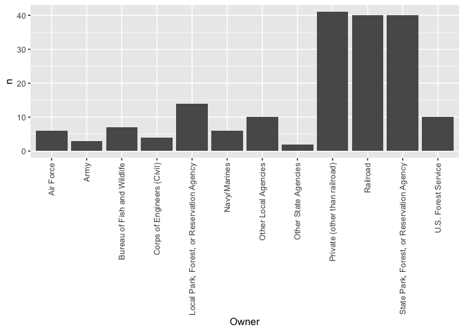

README
================
Lexi Luo
9/22/2021

### <https://github.com/QLexiLuo/STAT433-HW1>

``` r
library(data.table)
x = fread("https://www.fhwa.dot.gov/bridge/nbi/2020/delimited/IL20.txt")
str(x)
```

    ## Classes 'data.table' and 'data.frame':   26848 obs. of  123 variables:
    ##  $ STATE_CODE_001         : int  17 17 17 17 17 17 17 17 17 17 ...
    ##  $ STRUCTURE_NUMBER_008   : chr  "1IL00S1" "1IL00S9" "1IL0S12" "1IL114H" ...
    ##  $ RECORD_TYPE_005A       : int  1 1 1 1 1 1 1 1 1 1 ...
    ##  $ ROUTE_PREFIX_005B      : int  8 8 8 8 8 8 8 8 8 6 ...
    ##  $ SERVICE_LEVEL_005C     : int  1 1 1 1 1 1 1 1 1 0 ...
    ##  $ ROUTE_NUMBER_005D      : chr  "00000" "00000" "00000" "00000" ...
    ##  $ DIRECTION_005E         : int  0 0 0 0 0 0 0 0 0 0 ...
    ##  $ HIGHWAY_DISTRICT_002   : int  0 0 0 0 0 0 2 2 2 3 ...
    ##  $ COUNTY_CODE_003        : int  97 97 97 97 97 97 161 161 161 153 ...
    ##  $ PLACE_CODE_004         : int  17097 17097 17097 17097 17097 17097 65104 65104 65104 0 ...
    ##  $ FEATURES_DESC_006A     : chr  "'PETTIBONE CK/ CRUSLEY DR'" "'PETTIBONE CREEK'" "'PETTIBONE CREEK'" "'PETTIBONE CR  ACCESS RD'" ...
    ##  $ CRITICAL_FACILITY_006B : logi  NA NA NA NA NA NA ...
    ##  $ FACILITY_CARRIED_007   : chr  "'FARRAGUT AVENUE'" "'SAMPSON STREET'" "'10TH  STREET'" "'\"D\" STREET'" ...
    ##  $ LOCATION_009           : chr  "'0.5 KM E OF SHERIDAN RD'" "'0.5 KM S OF DECATUR AVE'" "'0.01KM S OF CROSLEY DR'" "'0.6 KM E OF SHERIDAN RD'" ...
    ##  $ MIN_VERT_CLR_010       : num  100 100 100 100 100 ...
    ##  $ KILOPOINT_011          : num  0 0 0 0 0 ...
    ##  $ BASE_HWY_NETWORK_012   : int  0 0 0 0 0 0 0 0 0 0 ...
    ##  $ LRS_INV_ROUTE_013A     : chr  "" "" "" "" ...
    ##  $ SUBROUTE_NO_013B       : int  NA NA NA NA NA NA NA NA NA NA ...
    ##  $ LAT_016                : int  42184349 42183278 42183355 42182323 42125442 42182620 41310998 41304338 41303863 37171500 ...
    ##  $ LONG_017               : num  87503280 87501963 87501036 87502790 87483036 ...
    ##  $ DETOUR_KILOS_019       : int  4 4 3 5 5 1 3 3 3 199 ...
    ##  $ TOLL_020               : int  3 3 3 3 3 3 3 3 3 3 ...
    ##  $ MAINTENANCE_021        : int  73 73 73 73 73 73 74 74 74 63 ...
    ##  $ OWNER_022              : int  73 73 73 73 73 73 74 74 74 63 ...
    ##  $ FUNCTIONAL_CLASS_026   : int  19 19 19 19 19 19 16 16 16 9 ...
    ##  $ YEAR_BUILT_027         : int  2005 1926 1938 2009 2005 1957 1896 1906 1981 1996 ...
    ##  $ TRAFFIC_LANES_ON_028A  : int  2 1 2 2 2 2 2 2 2 2 ...
    ##  $ TRAFFIC_LANES_UND_028B : int  1 0 0 0 2 0 2 0 1 0 ...
    ##  $ ADT_029                : int  12075 1260 210 4725 1050 210 18000 8900 9550 10 ...
    ##  $ YEAR_ADT_030           : int  2008 2008 2008 2008 2008 2008 2016 2018 2018 2019 ...
    ##  $ DESIGN_LOAD_031        : chr  "0" "0" "5" "5" ...
    ##  $ APPR_WIDTH_MT_032      : num  11.6 8.6 6.1 7.3 9.4 7.2 7.9 7.5 12.8 3 ...
    ##  $ MEDIAN_CODE_033        : int  0 0 0 0 0 0 0 0 0 0 ...
    ##  $ DEGREES_SKEW_034       : int  0 0 16 0 0 0 0 0 0 18 ...
    ##  $ STRUCTURE_FLARED_035   : int  1 0 0 0 1 0 0 0 0 0 ...
    ##  $ RAILINGS_036A          : chr  "1" "1" "1" "1" ...
    ##  $ TRANSITIONS_036B       : chr  "0" "0" "0" "0" ...
    ##  $ APPR_RAIL_036C         : chr  "0" "0" "0" "0" ...
    ##  $ APPR_RAIL_END_036D     : chr  "0" "0" "0" "0" ...
    ##  $ HISTORY_037            : int  5 3 5 5 5 5 1 2 5 5 ...
    ##  $ NAVIGATION_038         : chr  "N" "0" "0" "N" ...
    ##  $ NAV_VERT_CLR_MT_039    : num  0 0 0 0 0 0 7.3 0 0 0 ...
    ##  $ NAV_HORR_CLR_MT_040    : num  0 0 0 0 0 0 33.5 0 0 0 ...
    ##  $ OPEN_CLOSED_POSTED_041 : chr  "A" "P" "P" "P" ...
    ##  $ SERVICE_ON_042A        : int  5 5 1 5 5 5 4 1 1 1 ...
    ##  $ SERVICE_UND_042B       : int  6 5 5 5 1 5 8 5 6 5 ...
    ##  $ STRUCTURE_KIND_043A    : int  4 1 5 5 5 1 3 3 4 7 ...
    ##  $ STRUCTURE_TYPE_043B    : int  2 11 1 2 5 19 17 3 3 1 ...
    ##  $ APPR_KIND_044A         : int  0 0 0 0 0 0 3 0 4 0 ...
    ##  $ APPR_TYPE_044B         : int  0 0 0 0 0 0 10 0 2 0 ...
    ##  $ MAIN_UNIT_SPANS_045    : int  3 3 1 3 3 2 1 8 4 3 ...
    ##  $ APPR_SPANS_046         : int  0 0 0 0 0 0 7 0 8 0 ...
    ##  $ HORR_CLR_MT_047        : num  11.6 8.3 5.3 7.9 9.4 7.2 7.1 7.3 12.8 6.1 ...
    ##  $ MAX_SPAN_LEN_MT_048    : num  24.4 36.6 8.4 27.4 18.5 3 78.6 25.5 70.1 11.3 ...
    ##  $ STRUCTURE_LEN_MT_049   : num  55.1 105.2 9 83.5 55.2 ...
    ##  $ LEFT_CURB_MT_050A      : num  2.1 1.5 0 1.8 1.8 1.5 2 0.3 0 0 ...
    ##  $ RIGHT_CURB_MT_050B     : num  2.1 1.3 0 1.8 1.8 0.3 2 1.2 0 0 ...
    ##  $ ROADWAY_WIDTH_MT_051   : num  11.6 8.3 5.3 7.9 9.4 0 7.1 7.3 10.9 6.1 ...
    ##  $ DECK_WIDTH_MT_052      : num  16.5 12.2 6.4 12.2 13.7 0 7.7 10 13.8 6.8 ...
    ##  $ VERT_CLR_OVER_MT_053   : num  100 100 100 100 100 ...
    ##  $ VERT_CLR_UND_REF_054A  : chr  "N" "N" "N" "N" ...
    ##  $ VERT_CLR_UND_054B      : num  0 9.1 0 8.41 10.55 ...
    ##  $ LAT_UND_REF_055A       : chr  "N" "N" "N" "N" ...
    ##  $ LAT_UND_MT_055B        : num  0 3 0 1 0 0 0.6 0 0 0 ...
    ##  $ LEFT_LAT_UND_MT_056    : num  0 0 0 0 0 0 0 0 0 0 ...
    ##  $ DECK_COND_058          : chr  "7" "5" "6" "7" ...
    ##  $ SUPERSTRUCTURE_COND_059: chr  "7" "4" "5" "7" ...
    ##  $ SUBSTRUCTURE_COND_060  : chr  "7" "5" "6" "8" ...
    ##  $ CHANNEL_COND_061       : chr  "7" "6" "7" "8" ...
    ##  $ CULVERT_COND_062       : chr  "N" "N" "N" "N" ...
    ##  $ OPR_RATING_METH_063    : chr  "1" "0" "1" "1" ...
    ##  $ OPERATING_RATING_064   : num  54.7 10.9 54.1 71.2 74 36.2 16.2 38.9 32.4 51.7 ...
    ##  $ INV_RATING_METH_065    : chr  "1" "0" "1" "1" ...
    ##  $ INVENTORY_RATING_066   : num  32.7 10.9 32.4 42.6 32.6 32.6 13 29.2 25.9 35.4 ...
    ##  $ STRUCTURAL_EVAL_067    : chr  "7" "2" "5" "7" ...
    ##  $ DECK_GEOMETRY_EVAL_068 : chr  "5" "4" "2" "3" ...
    ##  $ UNDCLRENCE_EVAL_069    : chr  "N" "N" "N" "N" ...
    ##  $ POSTING_EVAL_070       : int  5 1 5 5 5 5 0 5 5 5 ...
    ##  $ WATERWAY_EVAL_071      : chr  "8" "8" "8" "N" ...
    ##  $ APPR_ROAD_EVAL_072     : int  8 8 6 7 8 8 3 8 8 4 ...
    ##  $ WORK_PROPOSED_075A     : int  38 31 38 38 38 38 35 35 37 NA ...
    ##  $ WORK_DONE_BY_075B      : int  2 1 1 1 1 1 1 1 1 NA ...
    ##  $ IMP_LEN_MT_076         : num  55.1 105.2 9 82.2 55.2 ...
    ##  $ DATE_OF_INSPECT_090    : int  318 318 318 318 318 318 1018 1018 1018 120 ...
    ##  $ INSPECT_FREQ_MONTHS_091: int  24 24 24 24 24 24 24 24 24 24 ...
    ##  $ FRACTURE_092A          : chr  "N" "N" "N" "N" ...
    ##  $ UNDWATER_LOOK_SEE_092B : chr  "N" "N" "N" "N" ...
    ##  $ SPEC_INSPECT_092C      : chr  "N" "N" "N" "N" ...
    ##  $ FRACTURE_LAST_DATE_093A: int  NA NA NA NA NA NA 1018 1018 1018 NA ...
    ##  $ UNDWATER_LAST_DATE_093B: int  NA NA NA NA NA NA 813 1116 1116 NA ...
    ##  $ SPEC_LAST_DATE_093C    : int  NA NA NA NA NA NA NA NA NA NA ...
    ##  $ BRIDGE_IMP_COST_094    : int  34 2 1 37 10 0 1 261 2 NA ...
    ##  $ ROADWAY_IMP_COST_095   : int  37 35 39 3 36 0 1 5 0 NA ...
    ##  $ TOTAL_IMP_COST_096     : int  71 37 40 40 46 0 2 266 2 NA ...
    ##  $ YEAR_OF_IMP_097        : int  2018 2018 2018 2018 2018 2018 2016 2018 2018 NA ...
    ##  $ OTHER_STATE_CODE_098A  : int  NA NA NA NA NA NA 197 NA NA NA ...
    ##  $ OTHER_STATE_PCNT_098B  : int  NA NA NA NA NA NA 0 NA NA NA ...
    ##  $ OTHR_STATE_STRUC_NO_099: chr  "" "" "" "" ...
    ##   [list output truncated]
    ##  - attr(*, ".internal.selfref")=<externalptr>

``` r
#Bridges in Illinois based on county code
library(ggplot2)
```

    ## Warning: package 'ggplot2' was built under R version 3.6.2

``` r
ggplot(data = x, aes(x$COUNTY_CODE_003)) +
  geom_histogram(color = "black", fill = "white") +
  theme(axis.title.x = element_text(color = "#993332")) +
  theme(axis.title.y = element_text(color = "#993332")) +
  xlab("County Code") +
  ggtitle("Bridges based on county code in IL") 
```

    ## `stat_bin()` using `bins = 30`. Pick better value with `binwidth`.

<!-- -->

``` r
#Bridges in Illinois Based on Owners
library(dplyr)
```

    ## Warning: package 'dplyr' was built under R version 3.6.2

    ## 
    ## Attaching package: 'dplyr'

    ## The following objects are masked from 'package:data.table':
    ## 
    ##     between, first, last

    ## The following objects are masked from 'package:stats':
    ## 
    ##     filter, lag

    ## The following objects are masked from 'package:base':
    ## 
    ##     intersect, setdiff, setequal, union

``` r
Ownership = x %>% group_by(OWNER_022) %>% summarise(n = n())
```

    ## `summarise()` ungrouping output (override with `.groups` argument)

``` r
Ownership$OWNER_022 <- c("State Highway Agency", "County Highway Agency", "Town or Township Highway Agency", 
                         "City or Municipal Highway Agency" , "State Park, Forest, or Reservation Agency", 
                         "Local Park, Forest, or Reservation Agency", "Other State Agencies", "Other Local Agencies",
                         "Private (other than railroad)", "Railroad", "State Toll Authority", "Bureau of Fish and Wildlife",
                         "U.S. Forest Service", "Corps of Engineers (Civil)", "Air Force", "Navy/Marines", "Army")

as.numeric(Ownership$n)
```

    ##  [1]  7853  4135 12166  1997    40    14     2    10    41    40   514     7
    ## [13]    10     4     6     6     3

``` r
newdata <- Ownership[order(Ownership$n),]
Group1 <- newdata %>%
  slice(1:12)
Group2 <- newdata %>%
  slice(13:17)

ggplot(data=Group1, aes(x=OWNER_022, y=n)) + 
  geom_bar(stat = "identity") +
  xlab("Owner") +
  theme(axis.text.x = element_text(angle = 90, vjust = 0.5, hjust=1))
```

<!-- -->

``` r
ggplot(data=Group2, aes(x=OWNER_022, y=n)) + 
  geom_bar(stat = "identity") +
  xlab("Owner") +
  theme(axis.text.x = element_text(angle = 90, vjust = 0.5, hjust=1))
```

<!-- -->
